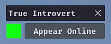

# True Introvert

A [Nexus](https://raidcore.gg/gw2/nexus) addon for [Guild Wars 2](https://www.guildwars2.com/) that automatically sets your status to "Invisible" when you close the game.

Optionally, you’ll get a prompt on login to quickly set your status to "Online" or "Away".

## Installation

> [!NOTE]
> You can install the addon directly through the in-game Nexus library with a single click.

If you prefer a manual install:

1. Download the latest [`true_introvert.dll`](https://github.com/mriot/true-introvert-releases/releases/latest/download/true_introvert.dll)
2. Put the file into your Guild Wars 2 Nexus addons folder (e.g., `C:/Program Files/Guild Wars 2/addons`)  
3. Enable the addon in-game in Nexus
4. Click the configure button to configure the addon to your liking

## Source Code

The source code is kept private to comply with ArenaNet’s guidelines for addons that interact with the game’s memory.  
Code review may be requested by ArenaNet at any time.

## Dependencies

- [Nexus](https://raidcore.gg/Nexus)
- [ImGui](https://github.com/ocornut/imgui)
- [inifile-cpp](https://github.com/Rookfighter/inifile-cpp)

A **big** thank you Bird for the addon name!

## Disclaimer

### ⚠️ USE AT YOUR OWN RISK ⚠️

The addon is provided as-is. It’s meant to be helpful, but I can’t take responsibility for problems that may occur.  
Using third-party addons in Guild Wars 2 is always at your own discretion.

---

This addon is not affiliated with nor endorsed by ArenaNet or NCSOFT.
